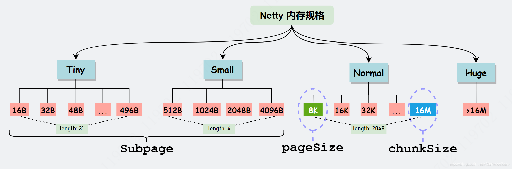
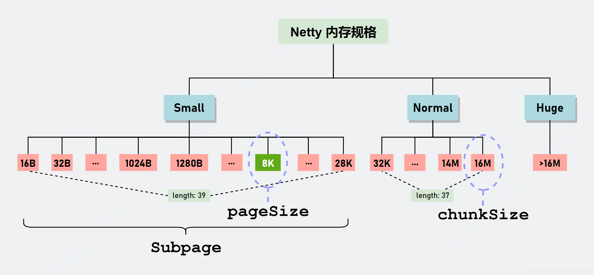
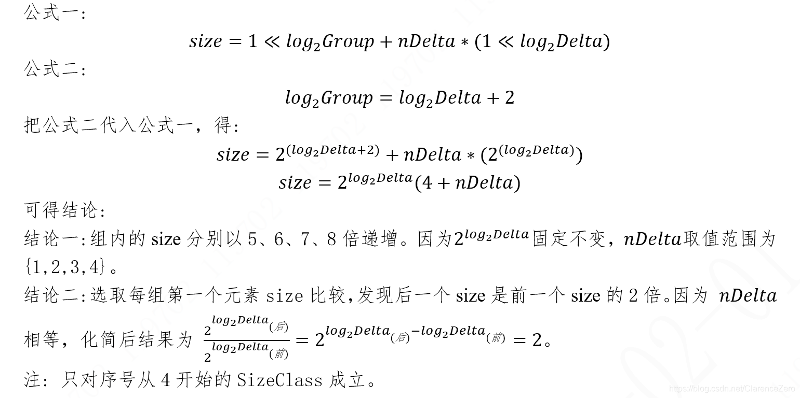
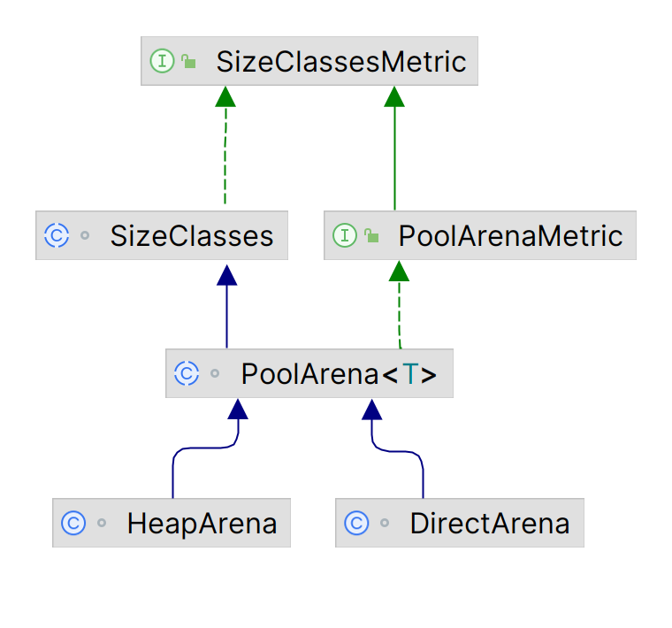

## Netty内存管理  Jemalloc4

### 概述

​		`Netty 4.1.45`以前采用`jemalloc3`算法 实现内存分配，而`Netty 4.1.45`之后使用`jemalloc4`算法分配内存。

​		jemalloc4 相较于 jemalloc3 最大的提升是进一步优化内存碎片问题，因为在 jemalloc3 中最多可能会导致 50% 内存碎片，但 jemalloc4 通过划分更细粒度的内存规格在一定程度上改善了这一问题.

​		Netty 使用jemalloc4后重构了和内存分配相关的核心类，比如 PoolArena、PoolChunk、PoolSubpage 以及和缓存相关的 PoolThreadCache，并且新增了一个 SizeClasses 类。





​		jemalloc4 相对于jemalloc3 取消了 Tiny 级别，如今只有 Small、Normal 和 Huge，而 SizeClasses 就是记录 Small 和 Normal 规格值的一张表（table），这张表记录了很多有用的信息。

### SizeClasses

官方进行了一些描述，翻译之后为：

```java
/**
 * SizeClasses要求在包含之前定义{@code pageShifts}，然后定义
 * <p>
 *   LOG2_SIZE_CLASS_GROUP： 每个尺寸翻倍的尺寸类计数的日志。
 *   LOG2_MAX_LOOKUP_SIZE: 在查找表中最大尺寸类的日志。
 *   sizeClasses： 完整的[索引、log2Group、log2Delta、nDelta、isMultiPageSize、 isSubPage, log2DeltaLookup] 图元。
 *      index： 大小类索引。
 *      log2Group： 组基本大小的对数（不加三角）。
 *      log2Delta： 与上一个大小类的delta的对数。
 *      nDelta： Delta乘数。
 *      isMultiPageSize：如果是页面大小的倍数则为 "是"，否则为 "否"。
 *      isSubPage： 如果是一个子页面大小类，则为'是'，否则为'否'
 *      log2DeltaLookup： 如果是查询表大小类，与log2Delta相同，否则为'否'。
 *    nSubpages： 子页大小类的数量。
 *    nSizes： 大小类的数量。
 *    nPSizes： 是pageSize的倍数的大小类的数量。
 *    smallMaxSizeIdx： 最大的小尺寸类索引。
 *    lookupMaxClass： 在查找表中包含的最大尺寸类。
 *    log2NormalMinClass： 最小正常尺寸类的日志。
 * <p>
 *   第一个尺寸类和间距是1 << LOG2_QUANTUM。
 *   每组有1 << LOG2_SIZE_CLASS_GROUP的大小类。
 *   size = 1 << log2Group + nDelta * (1 << log2Delta)
 *   第一个尺寸类有一个不寻常的编码，因为尺寸必须被分成 在组和delta*nDelta之间分割。
 *   如果pageShift = 13，sizeClasses看起来像这样：
 *   (index, log2Group, log2Delta, nDelta, isMultiPageSize, isSubPage, log2DeltaLookup)
 * <p>
 *   ( 0,     4,        4,         0,       no,             yes,        4)
 *   ( 1,     4,        4,         1,       no,             yes,        4)
 *   ( 2,     4,        4,         2,       no,             yes,        4)
 *   ( 3,     4,        4,         3,       no,             yes,        4)
 * <p>
 *   ( 4,     6,        4,         1,       no,             yes,        4)
 *   ( 5,     6,        4,         2,       no,             yes,        4)
 *   ( 6,     6,        4,         3,       no,             yes,        4)
 *   ( 7,     6,        4,         4,       no,             yes,        4)
 * <p>
 *   ( 8,     7,        5,         1,       no,             yes,        5)
 *   ( 9,     7,        5,         2,       no,             yes,        5)
 *   ( 10,    7,        5,         3,       no,             yes,        5)
 *   ( 11,    7,        5,         4,       no,             yes,        5)
 *   ...
 *   ...
 *   ( 72,    23,       21,        1,       yes,            no,        no)
 *   ( 73,    23,       21,        2,       yes,            no,        no)
 *   ( 74,    23,       21,        3,       yes,            no,        no)
 *   ( 75,    23,       21,        4,       yes,            no,        no)
 * <p>
 *   ( 76,    24,       22,        1,       yes,            no,        no)
 */
```

​		每一列表示的含义如下:

- index: 由 0 开始的自增序列号，表示每个 size 类型的索引。
- log2Group: 表示每个 size 它所对应的组。以每 4 行为一组，一共有 19 组。第 0 组比较特殊，它是单独初始化的。因此，我们应该从第 1 组开始，起始值为 6，每组的 log2Group 是在上一组的值 +1。
- log2Delta: 表示当前序号所对应的 size 和前一个序号所对应的 size 的差值的 log2 的值。比如 index=6 对应的 size = 112，index=7 对应的 size= 128，因此 index=7 的 log2Delta(7) = log2(128-112)=4。不知道你们有没有发现，其实 log2Delta=log2Group-2。
- nDelta: 表示组内增量的倍数。第 0 组也是比较特殊，nDelta 是从 0 开始 + 1。而其余组是从 1 开始 +1。
- isMultiPageSize: 表示当前 size 是否是 pageSize（默认值: 8192） 的整数倍。后续会把 isMultiPageSize=1 的行单独整理成一张表，你会发现有 40 个 isMultiPageSize=1 的行。
- isSubPage: 表示当前 size 是否为一个 subPage 类型，jemalloc4 会根据这个值采取不同的内存分配策略。
- log2DeltaLookup: 当 index<=27 时，其值和 log2Delta 相等，当index>27，其值为 0。但是在代码中没有看到具体用来做什么。

​		如果想到得到的是 index 与 size 的对应关系，在 SizeClasses 表中，无论哪一行的 size 都是由以下公式计算得到。



因此通过计算可得出每行的 size:

| index | log2Group | log2Delta | nDelta | isMultiPageSize | isSubPage | log2DeltaLookup | size     | Unit:MB |
| ----- | --------- | --------- | ------ | --------------- | --------- | --------------- | -------- | ------- |
| 0     | 4         | 4         | 0      | 0               | 1         | 4               | 16       |         |
| 1     | 4         | 4         | 1      | 0               | 1         | 4               | 32       |         |
| 2     | 4         | 4         | 2      | 0               | 1         | 4               | 48       |         |
| 3     | 4         | 4         | 3      | 0               | 1         | 4               | 64       |         |
| 4     | 6         | 4         | 1      | 0               | 1         | 4               | 80       |         |
| 5     | 6         | 4         | 2      | 0               | 1         | 4               | 96       |         |
| 6     | 6         | 4         | 3      | 0               | 1         | 4               | 112      |         |
| 7     | 6         | 4         | 4      | 0               | 1         | 4               | 128      |         |
| 8     | 7         | 5         | 1      | 0               | 1         | 5               | 160      |         |
| 9     | 7         | 5         | 2      | 0               | 1         | 5               | 192      |         |
| 10    | 7         | 5         | 3      | 0               | 1         | 5               | 224      |         |
| 11    | 7         | 5         | 4      | 0               | 1         | 5               | 256      |         |
| 12    | 8         | 6         | 1      | 0               | 1         | 6               | 320      |         |
| 13    | 8         | 6         | 2      | 0               | 1         | 6               | 384      |         |
| 14    | 8         | 6         | 3      | 0               | 1         | 6               | 448      |         |
| 15    | 8         | 6         | 4      | 0               | 1         | 6               | 512      |         |
| 16    | 9         | 7         | 1      | 0               | 1         | 7               | 640      |         |
| 17    | 9         | 7         | 2      | 0               | 1         | 7               | 768      |         |
| 18    | 9         | 7         | 3      | 0               | 1         | 7               | 896      |         |
| 19    | 9         | 7         | 4      | 0               | 1         | 7               | 1024     |         |
| 20    | 10        | 8         | 1      | 0               | 1         | 8               | 1280     |         |
| 21    | 10        | 8         | 2      | 0               | 1         | 8               | 1536     |         |
| 22    | 10        | 8         | 3      | 0               | 1         | 8               | 1792     |         |
| 23    | 10        | 8         | 4      | 0               | 1         | 8               | 2048     |         |
| 24    | 11        | 9         | 1      | 0               | 1         | 9               | 2560     |         |
| 25    | 11        | 9         | 2      | 0               | 1         | 9               | 3072     |         |
| 26    | 11        | 9         | 3      | 0               | 1         | 9               | 3584     |         |
| 27    | 11        | 9         | 4      | 0               | 1         | 9               | 4096     |         |
| 28    | 12        | 10        | 1      | 0               | 1         | 0               | 5120     |         |
| 29    | 12        | 10        | 2      | 0               | 1         | 0               | 6144     |         |
| 30    | 12        | 10        | 3      | 0               | 1         | 0               | 7168     |         |
| 31    | 12        | 10        | 4      | 1               | 1         | 0               | 8192     | 8KB     |
| 32    | 13        | 11        | 1      | 0               | 1         | 0               | 10240    | 10KB    |
| 33    | 13        | 11        | 2      | 0               | 1         | 0               | 12288    | 12KB    |
| 34    | 13        | 11        | 3      | 0               | 1         | 0               | 14336    | 14KB    |
| 35    | 13        | 11        | 4      | 1               | 1         | 0               | 16384    | 16KB    |
| 36    | 14        | 12        | 1      | 0               | 1         | 0               | 20480    | 20KB    |
| 37    | 14        | 12        | 2      | 1               | 1         | 0               | 24576    | 24KB    |
| 38    | 14        | 12        | 3      | 0               | 1         | 0               | 28672    | 28KB    |
| 39    | 14        | 12        | 4      | 1               | 0         | 0               | 32768    | 32KB    |
| 40    | 15        | 13        | 1      | 1               | 0         | 0               | 40960    | 40KB    |
| 41    | 15        | 13        | 2      | 1               | 0         | 0               | 49152    | 48KB    |
| 42    | 15        | 13        | 3      | 1               | 0         | 0               | 57344    | 56KB    |
| 43    | 15        | 13        | 4      | 1               | 0         | 0               | 65536    | 64KB    |
| 44    | 16        | 14        | 1      | 1               | 0         | 0               | 81920    | 80KB    |
| 45    | 16        | 14        | 2      | 1               | 0         | 0               | 98304    | 96KB    |
| 46    | 16        | 14        | 3      | 1               | 0         | 0               | 114688   | 112KB   |
| 47    | 16        | 14        | 4      | 1               | 0         | 0               | 131072   | 128KB   |
| 48    | 17        | 15        | 1      | 1               | 0         | 0               | 163840   | 160KB   |
| 49    | 17        | 15        | 2      | 1               | 0         | 0               | 196608   | 192KB   |
| 50    | 17        | 15        | 3      | 1               | 0         | 0               | 229376   | 224KB   |
| 51    | 17        | 15        | 4      | 1               | 0         | 0               | 262144   | 256KB   |
| 52    | 18        | 16        | 1      | 1               | 0         | 0               | 327680   | 320KB   |
| 53    | 18        | 16        | 2      | 1               | 0         | 0               | 393216   | 384KB   |
| 54    | 18        | 16        | 3      | 1               | 0         | 0               | 458752   | 448KB   |
| 55    | 18        | 16        | 4      | 1               | 0         | 0               | 524288   | 512KB   |
| 56    | 19        | 17        | 1      | 1               | 0         | 0               | 655360   | 640KB   |
| 57    | 19        | 17        | 2      | 1               | 0         | 0               | 786432   | 768KB   |
| 58    | 19        | 17        | 3      | 1               | 0         | 0               | 917504   | 896KB   |
| 59    | 19        | 17        | 4      | 1               | 0         | 0               | 1048576  | 1.0MB   |
| 60    | 20        | 18        | 1      | 1               | 0         | 0               | 1310720  | 1.25MB  |
| 61    | 20        | 18        | 2      | 1               | 0         | 0               | 1572864  | 1.5MB   |
| 62    | 20        | 18        | 3      | 1               | 0         | 0               | 1835008  | 1.75MB  |
| 63    | 20        | 18        | 4      | 1               | 0         | 0               | 2097152  | 2MB     |
| 64    | 21        | 19        | 1      | 1               | 0         | 0               | 2621440  | 2.5MB   |
| 65    | 21        | 19        | 2      | 1               | 0         | 0               | 3145728  | 3MB     |
| 66    | 21        | 19        | 3      | 1               | 0         | 0               | 3670016  | 3.5MB   |
| 67    | 21        | 19        | 4      | 1               | 0         | 0               | 4194304  | 4MB     |
| 68    | 22        | 20        | 1      | 1               | 0         | 0               | 5242880  | 5MB     |
| 69    | 22        | 20        | 2      | 1               | 0         | 0               | 6291456  | 6MB     |
| 70    | 22        | 20        | 3      | 1               | 0         | 0               | 7340032  | 7MB     |
| 71    | 22        | 20        | 4      | 1               | 0         | 0               | 8388608  | 8MB     |
| 72    | 23        | 21        | 1      | 1               | 0         | 0               | 10485760 | 10MB    |
| 73    | 23        | 21        | 2      | 1               | 0         | 0               | 12582912 | 12MB    |
| 74    | 23        | 21        | 3      | 1               | 0         | 0               | 14680064 | 14MB    |
| 75    | 23        | 21        | 4      | 1               | 0         | 0               | 16777216 | 16MB    |

​		从表中可以发现，不管对于哪种内存规格，它都有更细粒度的内存大小的划分。比如在 512Byte~8192Byte 范围内，现在可分为 512、640、768 等等，不再是 jemalloc3 只有 512、1024、2048 … 这种粒度比较大的规格值了。这就是 jemalloc4 最大的提升。

​		SizeClasses 可以看成是一个数组结构，是存储数组索引 index 和 size 的映射关系和维护其他数组以避免多次计算。



PoolArena 这个大管家通过继承 SizeClasses 拥有内部的数据结构，可以直接调用相关 API。接口 SizeClassMetric 定义了与 SizeClasses 相关的核心的 API。

### SizeClassesMetric

源码及解释如下：

```java
package io.netty.buffer;

/**
 * 为一个SizeClasses暴露度量。
 */
public interface SizeClassesMetric {

    /**
     * 根据sizeIdx从查找表中计算出size大小。
     *
     * @return size
     */
    int sizeIdx2size(int sizeIdx);

    /**
     * 根据sizeIdx计算size大小。
     *
     * @return size
     */
    int sizeIdx2sizeCompute(int sizeIdx);

    /**
     * 根据pageIdx从查找表中计算大小。
     *
     * @return 的大小是pageSize的倍数
     */
    long pageIdx2size(int pageIdx);

    /**
     * 根据pageIdx计算大小。
     *
     * @return 的大小是pageSize的倍数
     */
    long pageIdx2sizeCompute(int pageIdx);

    /**
     * 将请求的大小规范化到最接近的大小等级。
     *
     * @param size 请求大小
     *
     * @return sizeIdx of the size class
     */
    int size2SizeIdx(int size);

    /**
     * 将请求的大小规范化到最接近的pageSize类。
     *
     * @param pages multiples of pageSizes
     *
     * @return pageIdx of the pageSize class
     */
    int pages2pageIdx(int pages);

    /**
     * 将请求大小规范化为最接近的pageSize类。
     *
     * @param pages multiples of pageSizes
     *
     * @return pageIdx of the pageSize class
     */
    int pages2pageIdxFloor(int pages);

    /**
     * 将分配一个具有指定大小和对齐方式的对象所产生的可用大小规范化。
     *
     * @param size request size
     *
     * @return normalized size
     */
    int normalizeSize(int size);
}

```

### PoolChunk

官方描述如下：

```java
/**
 * PoolChunk中的PageRun/PoolSubpage分配算法描述
 *
 * 提示： 以下术语对理解代码很重要
 * > page - 页是可以分配的最小的内存块单位。
 * > run - 一个运行是一个页的集合
 * > chunk - 一个chunk是一个运行的集合
 * > 在这段代码中 chunkSize = maxPages * pageSize
 *
 * To begin we allocate a byte array of size = chunkSize
 * Whenever a ByteBuf of given size needs to be created we search for the first position
 * in the byte array that has enough empty space to accommodate the requested size and
 * return a (long) handle that encodes this offset information, (this memory segment is then
 * marked as reserved so it is always used by exactly one ByteBuf and no more)
 *
 * 首先，我们分配一个大小=chunkSize的字节数组。
 * 每当需要创建一个给定大小的ByteBuf时，我们就在字节数组中搜索第一个位置，
 * 该位置有足够的空位来容纳所要求的大小，并且 返回一个编码这个偏移信息的（长）handle，
 * （这个内存段然后被标记为保留，所以它总是被使用。
 * 这个内存段被标记为保留，所以它总是被一个ByteBuf使用，而不是更多）
 *
 * For simplicity all sizes are normalized according to {@link PoolArena#size2SizeIdx(int)} method.
 * This ensures that when we request for memory segments of size > pageSize the normalizedCapacity
 * equals the next nearest size in {@link SizeClasses}.
 *
 * 为了简单起见，所有的大小都按照{@link PoolArena#size2SizeIdx(int)}方法归一化。
 * 这确保了当我们请求的内存段尺寸大于pageSize时，标准化的Capacity
 * 等于{@link SizeClasses}中下一个最接近的大小。
 *
 *
 *  一个块具有以下布局：
 *
 *     /-----------------\
 *     | run             |
 *     |                 |
 *     |                 |
 *     |-----------------|
 *     | run             |
 *     |                 |
 *     |-----------------|
 *     | unalloctated    |
 *     | (freed)         |
 *     |                 |
 *     |-----------------|
 *     | subpage         |
 *     |-----------------|
 *     | unallocated     |
 *     | (freed)         |
 *     | ...             |
 *     | ...             |
 *     | ...             |
 *     |                 |
 *     |                 |
 *     |                 |
 *     \-----------------/
 *
 *
 * handle:
 * -------
 * a handle is a long number, the bit layout of a run looks like:
 * 一个handle是一个长数字，一个运行的位布局看起来像：
 *
 * oooooooo ooooooos ssssssss ssssssue bbbbbbbb bbbbbbbb bbbbbbbb bbbbbbbb
 *
 * o: runOffset (page offset in the chunk), 15bit
 * s: size (number of pages) of this run, 15bit
 * u: isUsed?, 1bit
 * e: isSubpage?, 1bit
 * b: bitmapIdx of subpage, zero if it's not subpage, 32bit  子页的bitmapIdx，如果不是子页则为零，32位
 *
 * runsAvailMap:
 * ------
 * a map which manages all runs (used and not in used).
 * For each run, the first runOffset and last runOffset are stored in runsAvailMap.
 * 一个管理所有运行（已使用和未使用）的map。
 * 对于每个run，第一个runOffset和最后一个runOffset被存储在runsAvailMap中。
 * key: runOffset
 * value: handle
 *
 * runsAvail:
 * ----------
 * an array of {@link PriorityQueue}.
 * Each queue manages same size of runs.
 * Runs are sorted by offset, so that we always allocate runs with smaller offset.
*
 * 一个{@link PriorityQueue}的数组。
 * 每个队列都管理着相同大小的运行。
 * 运行是按偏移量排序的，所以我们总是分配给偏移量较小的运行。
 *
 * Algorithm:
 * ----------
 *
 *   As we allocate runs, we update values stored in runsAvailMap and runsAvail so that the property is maintained.
 *   当我们分配运行时，我们会更新存储在runningAvailMap和runningAvail中的值，这样就可以保持该属性。
 *
 * Initialization - 初始化
 *  In the beginning we store the initial run which is the whole chunk.
 *  在开始的时候，我们存储初始运行，也就是整块的内容。
 *  The initial run:
 *  最初的运行：
 *  runOffset = 0
 *  size = chunkSize
 *  isUsed = no
 *  isSubpage = no
 *  bitmapIdx = 0
 *
 *
 * Algorithm: [allocateRun(size)]
 * ----------
 * 1) find the first avail run using in runsAvails according to size
 * 2) if pages of run is larger than request pages then split it, and save the tailing run
 *    for later using
 *
 * 1) 根据大小，在runningAvails中找到第一个可用的运行。
 * 2) 如果运行的页数大于请求的页数，则将其分割，并将尾部的运行保存起来，以便以后使用。
 *
 * Algorithm: [allocateSubpage(size)]
 * ----------
 * 1) find a not full subpage according to size.
 *    if it already exists just return, otherwise allocate a new PoolSubpage and call init()
 *    note that this subpage object is added to subpagesPool in the PoolArena when we init() it
 * 2) call subpage.allocate()
 *
 * 1) 根据大小找到一个未满的子页。
 *    如果它已经存在就返回，否则分配一个新的PoolSubpage并调用init()。
 *    注意，当我们init()时，这个subpage对象会被添加到PoolArena的subpagesPool中。
 * 2) 调用subpage.allocate()
 *
 * Algorithm: [free(handle, length, nioBuffer)]
 * ----------
 * 1) if it is a subpage, return the slab back into this subpage
 * 2) if the subpage is not used or it is a run, then start free this run
 * 3) merge continuous avail runs
 * 4) save the merged run
 *
 * 1）如果它是一个子页，则将板块返回到这个子页中。
 * 2) 如果该子页没有被使用，或者它是一个运行，那么就开始释放这个运行
 * 3) 合并连续使用的运行
 * 4) 保存合并后的运行
 *
 */
```

PoolChunk 对象中有两个重要的变量用来替换 jemalloc3 的树的结构，分别是 `LongPriorityQueue[] runsAvail` 和 `LongLongHashMap runsAvailMap`。

#### LongPriorityQueue

```java
    /**
     * manage all avail runs
     * 管理所有可用的运行
     */
    private final LongPriorityQueue[] runsAvail;
```

​		LongPriorityQueue 是 Netty 内部实现的关于 long 基本类型的优先队列，关于 LongPriorityQueue 和 LongLongHashMap 的动机请看，它是基于二叉堆实现。
​		LongPriorityQueue 属于小顶堆，存储 long （非 Long）型的句柄值，通过 LongPriorityQueue#poll() 方法每次都能获取小顶堆内部的最小的 handle 值。这表示我们每次申请内存都是从最低位地址开始分配。而在 PoolChunk 内部有一个 LongPriorityQueue[] 数组，所有存储在 LongPriorityQueue 对象的 handle 都表示一个可用的 run，它的默认长度为 40。

#### LongLongHashMap

```java
    /**
     * store the first page and last page of each avail run
     * 储存每一次运行的第一页和最后一页
     */
    private final LongLongHashMap runsAvailMap;
```

​		这个是特殊的存储 long 原型的 HashMap，底层采用线性探测法。Netty 使用 LongLongHashMap 存储某个 run 的首页偏移量和句柄值的映射关系、最后一页偏移量和句柄值的映射关系。为了在向前、向后合并的过程中能通过 pageOffset 偏移量获取句柄值，进而判断是否可以进行向前合并操作。

#### long handle

主要的区别是重新定义了高 32 位的含义。我们知道 PoolChunk 默认向 JVM 申请个 16MB 的大的内存块，并拆分成 2048 个 page。可以想象为每个 page 进行标号，从 0 开始一直到 2047。通过 pageOffset + pageSize 就能定位某一个 run 区域，它是由 pageSize 个 page 组成的，起始的 page 为 pageOffset。对 ByteBuffer 对象而言，内部会有一个 long 型的 memoryAddress 绝对地址，因此可以通过绝对地址+偏移量定位任意 page 的实际地址。
我们之前说过，run 表示的是由若干个 page 组成的内存块。而 isUsed 则是标记当前 run 的使用状态。isSubpage 表示当前 run 是否用于 Small 级别内存分配。后 32 位表示 bitmap 的索引信息，与 jemalloc3 表示的含义一样。

#### run

run 是由若干个连续的 page 组成的内存块的代称，可以被 long 型的 handle 表示。随着内存块的分配和回收，PoolChunk 会管理着若干个不连续的 run。

### 内存分配过程

####  jemalloc4 算法逻辑

1. Netty 默认一次性向 JVM 申请 16MB 大小的内存块，也是划分为 2048 个page，每个 page 大小为 8192（8KB）（和 jemalloc3 一样）。
2. 首先，根据用户申请的内存大小在 SizeClasses 查表得到确定的 index 索引值。
3. 通过判断 index 大小就可以知道采用什么策略。当 index<=38（对应 size<=28KB）时，表示当前分配 Small 级别大小的内存块，采用 Small 级别分配策略。对于 38<index<nSize(75)（对应 size取值范围为 (28KB, 16MB]）表示当前分配 Normal 级别大小的内存块，采用 Normal 级别分配策略。对于 index 的其他值，则对应 Huge 级别。
4. 先讲 Normal 级别的内存分配，它有一个特点就是所需要的内存大小是 pageSize 的整数倍，PoolChunk 会从能满足当前分配的 run（由 long 型的句柄表示，从 LongPriorityQueue[] 数组中搜索第一个最合适的 run） 中得到若干个 page。当某一个 run 分配若干个 page 之后，可会还会有剩余空闲的 page，那么它根据剩余的空闲 pages 数量会从 LongPriorityQueue[] 数组选取一个合适的 LongPriorityQueue 存放全新的 run（handle 表示）。
5. 对于 Small 级别的内存分配，经过 SizeClass 规格化后得到规格值 size，然后求得 size 和 pageSize 最小公倍数 j，j 一定是 pageSize 的整数倍。然后再按照 Normal 级别的内存分配方式从第一个适合的 run 中分配 (j/pageSize) 数量的 page。剩下的就和 jemalloc3 一样，将 page 所组成的内存块拆分成等分的 subpage，并使用 long[] 记录每份 subpage 的使用状态。

#### **run 回收**

- 在回收某一个 run 之前，先尝试向前搜索并合并相邻的空闲的 run，得到一个全新的 handle。

- 然后再向后搜索并合并相邻的空闲的 run，得到一个全新的 handle。

- 再把 handle 写回前面两个重要的数据结构中，以待下次分配时使用。

#### allocate代码

allocate代码为**io.netty.buffer.PoolArena**中的**allocate**方法，如下：

```java
/**
 * 按不同规格类型采用不同的内存分配策略
 * 这个方法主要是对用户申请的内存大小进行 SizeClasses 规格化，获取在 SizeClasses 的索引，通过判断索引值的大小采取不同的分配策略
 * @param cache			本地线程缓存
 * @param buf			ByteBuf对象，是byte[]或ByteBuffer的承载对象
 * @param reqCapacity	申请内存容量大小
 */
private void allocate(PoolThreadCache cache, PooledByteBuf<T> buf, final int reqCapacity) {

    // 根据申请容量大小查表确定对应数组下标序号。
    // 具体操作就是先确定 reqCapacity 在第几组，然后在组内的哪个位置。两者相加就是最后的值了
    final int sizeIdx = size2SizeIdx(reqCapacity);  //size2SizeIdx将请求的大小规范化到最接近的大小等级。

    // 根据下标序号就可以得到对应的规格值
    if (sizeIdx <= smallMaxSizeIdx) {
        // 下标序号<=「smallMaxSizeIdx」，表示申请容量大小<=pageSize，属于「Small」级别内存分配
        tcacheAllocateSmall(cache, buf, reqCapacity, sizeIdx);
    } else if (sizeIdx < nSizes) { // 28KB<size<=16MB
        // 下标序号<「nSizes」，表示申请容量大小介于pageSize和chunkSize之间，属于「Normal」级别内存分配
        tcacheAllocateNormal(cache, buf, reqCapacity, sizeIdx);
    } else {
        // 超出「ChunkSize」，属于「Huge」级别内存分配
        int normCapacity = directMemoryCacheAlignment > 0 ? normalizeSize(reqCapacity) : reqCapacity;
        // Huge allocations are never served via the cache so just call allocateHuge
        // 巨大的分配不会通过缓存提供，所以只需调用allocateHuge即可。
        allocateHuge(buf, normCapacity);
    }
}
```


### Normal 内存块分配方式

当 `smallMaxSizeIdx<sizeIdx<nSize` 时就采用 Normal 级别内存分配策略，对应的 size 范围是 `(28KB, 16MB]`。

Normal 内存块分配方式流程大致为:

- *PoolArena#allocate*  ->  (上一节代码)  按不同规格类型采用不同的内存分配策略
- PoolArena#tcacheAllocateNormal  ->  *尝试先从本地线程缓存中分配内存*
- PoolArena#allocateNormal
- PoolChunk#allocate  ->  *内存分配。可以完成Small&Normal两种级别的内存分配*
- PoolChunk#allocateRun  ->  从 run 分配若干个 page。

- PoolChunk#runFirstBestFit  ->  搜索 runsAvail 小顶堆数组寻找最合适的 run 用于此次内存分配
- PoolChunk#splitLargeRun  ->  *把「run」拆分成合适的两部分*
- PoolChunk#insertAvailRun  -> 从 runsAvail 数组中选择合适的 LongPriorityQueue 并写入。

#### PoolArena#tcacheAllocateNormal

```java
/**
 * 尝试先从本地线程缓存中分配内存，尝试失败，
 * 就会从不同使用率的「PoolChunkList」链表中寻找合适的内存空间并完成分配。
 * 如果这样还是不行，那就只能创建一个船新PoolChunk对象
 * @param cache         本地线程缓存，用来提高内存分配效率
 * @param buf           ByteBuf承载对象
 * @param reqCapacity    用户申请的内存大小
 * @param sizeIdx        对应{@link SizeClasses}的索引值，可以通过该值从{@link SizeClasses}中获取相应的规格值
 */
private void tcacheAllocateNormal(PoolThreadCache cache, PooledByteBuf<T> buf, final int reqCapacity,
                                  final int sizeIdx) {
    // 首先尝试从「本地线程缓存(线程私有变量，不需要加锁)」分配内存
    if (cache.allocateNormal(this, buf, reqCapacity, sizeIdx)) {
        // 尝试成功，直接返回。本地线程会完成对「ByteBuf」对象的初始化工作
        // was able to allocate out of the cache so move on 能够从缓存中分配，所以继续前进。
        return;
    }
    // 因为对「PoolArena」对象来说，内部的PoolChunkList会存在线程竞争，需要加锁
    lock();
    try {
        // 委托给「PoolChunk」对象完成内存分配
        allocateNormal(buf, reqCapacity, sizeIdx, cache);
        ++allocationsNormal;
    } finally {
        // 解锁
        unlock();
    }
}
```

#### PoolArena#allocateNormal

```java
/**
 * 先从「PoolChunkList」链表中选取某一个「PoolChunk」进行内存分配，如果实在找不到合适的「PoolChunk」对象，
 * 那就只能新建一个船新的「PoolChunk」对象，在完成内存分配后需要添加到对应的PoolChunkList链表中。
 * 内部有多个「PoolChunkList」链表，q050、q025表示内部的「PoolChunk」最低的使用率。
 * Netty 会先从q050开始分配，并非从q000开始。
 * 这是因为如果从q000开始分配内存的话会导致有大部分的PoolChunk面临频繁的创建和销毁，造成内存分配的性能降低。
 *
 * @param buf         ByeBuf承载对象
 * @param reqCapacity 用户所需要真实的内存大小
 * @param sizeIdx     对应{@link SizeClasses}的索引值，可以通过该值从{@link SizeClasses}中获取相应的规格值
 * @param threadCache 本地线程缓存，这个缓存主要是为了初始化PooledByteBuf时填充对象内部的缓存变量
 */
private void allocateNormal(PooledByteBuf<T> buf, int reqCapacity, int sizeIdx, PoolThreadCache threadCache) {
    assert lock.isHeldByCurrentThread();
    // 尝试从「PoolChunkList」链表中分配（寻找现有的「PoolChunk」进行内存分配）
    if (q050.allocate(buf, reqCapacity, sizeIdx, threadCache) ||
        q025.allocate(buf, reqCapacity, sizeIdx, threadCache) ||
        q000.allocate(buf, reqCapacity, sizeIdx, threadCache) ||
        qInit.allocate(buf, reqCapacity, sizeIdx, threadCache) ||
        q075.allocate(buf, reqCapacity, sizeIdx, threadCache)) {
        // 分配成功，直接返回
        return;
    }

    // 新建一个「PoolChunk」对象
    // Add a new chunk.
    PoolChunk<T> c = newChunk(pageSize, nPSizes, pageShifts, chunkSize);

    // 使用新的「PoolChunk」完成内存分配
    boolean success = c.allocate(buf, reqCapacity, sizeIdx, threadCache);
    assert success;

    // 根据最低的添加到「PoolChunkList」节点中
    qInit.add(c);
}
```


#### PoolChunk#allocate

```java
/**
 * 内存分配。可以完成Small&Normal两种级别的内存分配
 * @param buf           ByteBuf承载对象
 * @param reqCapacity    用户所需真实的内存大小
 * @param sizeIdx       内存大小对应{@link SizeClasses} 数组的索引值
 * @param cache         本地线程缓存
 * @return              {code true}: 内存分配成功，否则内存分配失败
 */
boolean allocate(PooledByteBuf<T> buf, int reqCapacity, int sizeIdx, PoolThreadCache cache) {
    // long型的handle表示分配成功的内存块的句柄值，它与jemalloc3所表示的含义不一下
    final long handle;

    // 当sizeIdx<=38（38是默认值）时，表示当前分配的内存规格是Small
    if (sizeIdx <= arena.smallMaxSizeIdx) {
        // small 分配Small规格内存块
        handle = allocateSubpage(sizeIdx);
        if (handle < 0) {
            return false;
        }
        assert isSubpage(handle);
    } else {
        // normal  分配Normal级别内存块，runSize是pageSize的整数倍
        // runSize must be multiple of pageSize
        int runSize = arena.sizeIdx2size(sizeIdx);
        handle = allocateRun(runSize);
        if (handle < 0) {
            return false;
        }
        assert !isSubpage(handle);
    }
    // 尝试从cachedNioBuffers缓存中获取ByteBuffer对象并在ByteBuf对象初始化时使用
    ByteBuffer nioBuffer = cachedNioBuffers != null? cachedNioBuffers.pollLast() : null;

    // 初始化ByteBuf对象
    initBuf(buf, nioBuffer, handle, reqCapacity, cache);

    // return
    return true;
}
```


#### PoolChunk#allocateRun

```java
/**
 * 分配若干page
 *
 * @param runSize 规格值，该值是pageSize的整数倍
 * @return
 */
private long allocateRun(int runSize) {

    // 根据规格值计算所需「page」的数量，这个数量值很重要:
    // 我们需要通过page数量获得搜索「LongPriorityQueue」的起始位置，并不是盲目从头开始向下搜索，
    // 这样会导致性能较差，而是在一合理的范围内找到第一个且合适的run
    int pages = runSize >> pageShifts;

    // 根据page的数量确定page的起始索引，索引值对应「runsAvail[]」数组起始位置
    // 这里就是前面所说的向上取整，从拥有多一点的空闲页的run中分配准是没错的选择
    int pageIdx = arena.pages2pageIdx(pages);

    // runsAvail 属于并发变量，需要加锁
    runsAvailLock.lock();
    try {
        // find first queue which has at least one big enough run
        // 找到第一个至少有一个足够大的运行的队列
        // 从「LongPriorityQueue[]」数组中找到最合适的run用于当前的内存分配请求。
        // 起始位置为「pageIdx」，并向后遍历直到数组的末尾或找到合适的run
        // 如果没有找到，返回-1
        int queueIdx = runFirstBestFit(pageIdx);
        if (queueIdx == -1) {
            return -1;
        }

        // get run with min offset in this queue
        // 在这个队列中获得最小偏移量的运行
        // 获取「LongPriorityQueue」，该对象包含若干个可用的 run
        LongPriorityQueue queue = runsAvail[queueIdx];

        // 从「LongPriorityQueue」小顶堆中获取可用的 run（由handle表示）
        // 小顶堆能保证始终保持从低地址开始分配
        long handle = queue.poll();
        assert handle != LongPriorityQueue.NO_VALUE && !isUsed(handle) : "invalid handle: " + handle;

        // 先将「handle」从该小顶堆中移除，因为我们有可能需要对它进行修改
        removeAvailRun0(handle);

        if (handle != -1) {
            // 可能会把「run」拆分成两部分。为什么说可能呢?因为这个run可能刚好满足此次分配需求，所以不用拆分。
            // 一部分用于当前内存申请。
            // 另一部分则剩余空闲内存块，这一部分则会放到合适的LongPriorityQueue数组中，待下次分配时使用。
            // 返回的 handle 表示当前内存申请的句柄信息
            handle = splitLargeRun(handle, pages);
        }

        // 更新剩余空间值
        int pinnedSize = runSize(pageShifts, handle);
        freeBytes -= pinnedSize;
        //返回成功申请的句柄信息
        return handle;
    } finally {
        runsAvailLock.unlock();
    }
}
```


#### PoolChunk#runFirstBestFit

```
	// 从pageIdx开始搜索最合适的run用于内存分配
    // 从pageIdx开始搜索 runsAvail 小顶堆数组寻找最合适的 run 用于此次内存分配。
    // 它很简单，从 pageIdx 不断遍历寻找即可。
    private int runFirstBestFit(int pageIdx) {
        if (freeBytes == chunkSize) {
            return arena.nPSizes - 1;
        }

        // 比较简单，从pageIdx向后遍历，找到queue!=null且不为空的LongPriorityQueue
        for (int i = pageIdx; i < arena.nPSizes; i++) {
            LongPriorityQueue queue = runsAvail[i];
            if (queue != null && !queue.isEmpty()) {
                return i;
            }
        }
        return -1;
    }
```


#### PoolChunk#splitLargeRun 


#### PoolChunk#insertAvailRun
